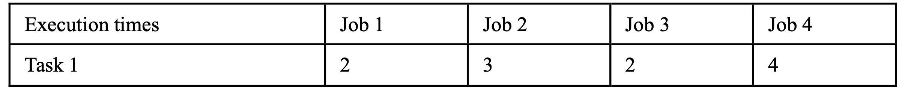
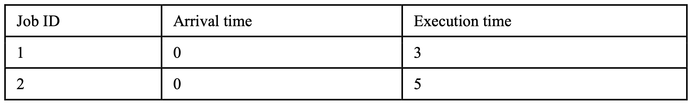
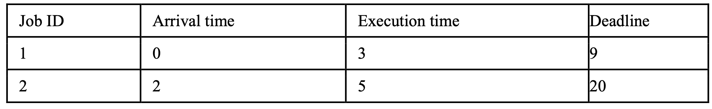

# real-time-system
### Assume there are 100 available hard real-time tasks, 100 aperiodic jobs and 100 sporadic jobs in the system. There is only one processor in the system, please schedule as most tasks as possible for the single processor system for 10000 time units.
## Inputs
### HRTTaskmodel.txt Format:1 0 5 2 4 7

### OnlinejobsOfHRT.txt Format:2 3 2 4 2 3 3 4 2 3 4 3 4 4 2 3 4.......

### OnlinejobsOf100SP.txt Format:0 3 9

## Outputs
### 
1. Find the minimum required processors that can execute all the hard real-time tasks.
2. Average CPU utilization of each processor in the duration, 10000 time units.
3. Compute the average response time of aperiodic jobs.
4. Compute the average waiting time of aperiodic jobs.
5. Loss of sporadic jobs.
6. ID list of the executable sporadic jobs.
